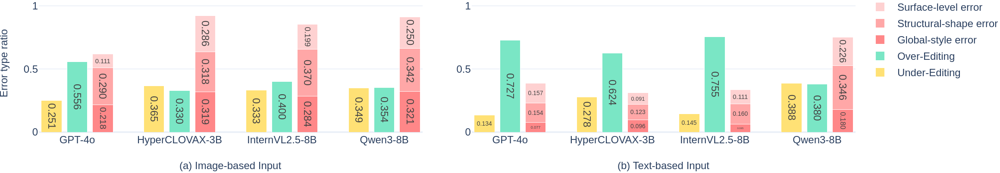
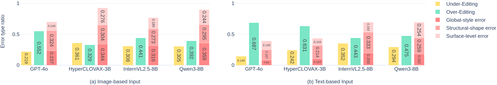
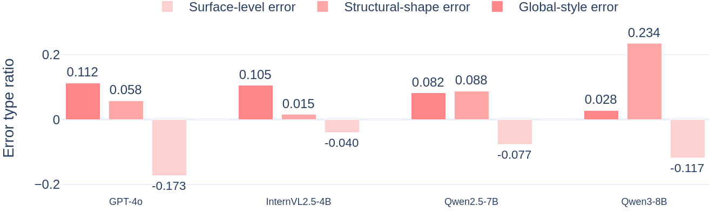
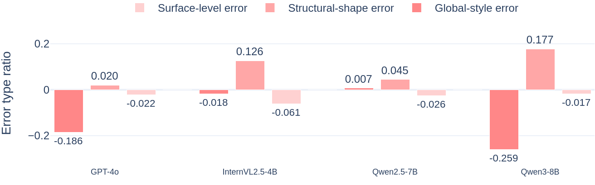
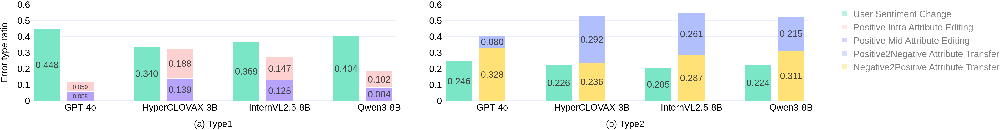
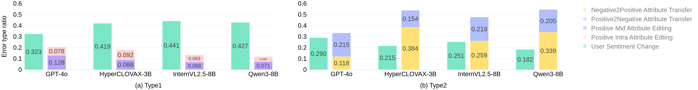
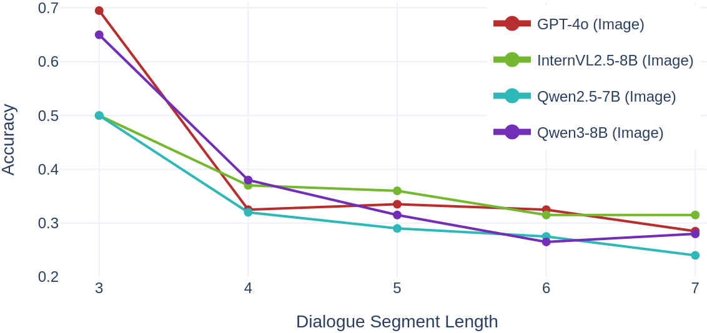
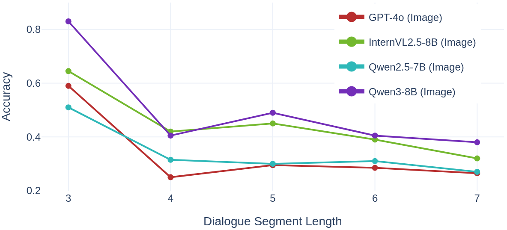

# Main Results on MMID

To further examine whether the main findings of MMID generalize across languages, we translated the original Korean version of MMID into English and conducted the same evaluation on the translated benchmark.

For dialogue translation, we translated each utterance individually using gpt-4.1-mini-2025-04-14 to preserve both translation fidelity and the original number of utterances in each dialogue. We also manually verified cases such as brand names and other text spans that should remain unchanged. In addition, to preserve the fashion-domain knowledge annotated in MMID, we translated each Korean label into English using a manually verified mapping. For example, the Korean label 상의:카테고리:블라우스 was translated into top:category:blouse based on mappings such as {상의: top, 카테고리: category, 블라우스: blouse}.

Overall, the experimental results for both Perception–Memorization Ability (RQ1) and Memorization–Reasoning Ability (RQ2) show similar patterns across the Korean and English versions of MMID. While the main paper presents the detailed results for the Korean version, this session additionally provides the quantitative results and representative error analyses for the English version.

## Perception–Memorization Ability (RQ1)

| Models         | Task 1 (IoU) Image | Task 2 Image | Task 3 Type 1 Image | Task 3 Type 1 Tags | Task 3 Type 1 Diff | Task 3 Type 2 Image | Task 3 Type 2 Tags | Task 3 Type 2 Diff | Task 4 Image | Task 4 Tags | Task 4 Diff |
| -------------- | -----------------: | -----------: | ------------------: | -----------------: | -----------------: | ------------------: | -----------------: | -----------------: | -----------: | ----------: | ----------: |
| GPT-4o         |               38.3 |         47.2 |                30.2 |               68.8 |               38.7 |                67.1 |               95.5 |               28.4 |         73.8 |        95.0 |        21.3 |
| Qwen3 8B       |               24.9 |         27.1 |                26.5 |               78.5 |               52.0 |                28.6 |               90.4 |               61.8 |         39.5 |        94.8 |        55.3 |
| Qwen3 4B       |               21.5 |         26.5 |                26.0 |               69.7 |               43.7 |                27.2 |               83.7 |               56.5 |         33.6 |        81.4 |        47.8 |
| Qwen3 2B       |                3.5 |         26.7 |                24.5 |               51.3 |               26.8 |                26.5 |               65.8 |               39.3 |         29.3 |        56.3 |        27.0 |
| Qwen2.5 7B     |               32.8 |         42.8 |                29.2 |               75.2 |               46.0 |                50.0 |               86.7 |               36.7 |         51.0 |        86.1 |        35.1 |
| Qwen2.5 3B     |               23.2 |         37.6 |                27.7 |               59.3 |               31.7 |                31.8 |               68.4 |               36.6 |         48.0 |        88.3 |        40.3 |
| InternVL2.5 8B |                6.9 |         30.2 |                28.3 |               73.5 |               45.2 |                32.3 |               69.4 |               37.1 |         36.5 |        64.8 |        28.3 |
| InternVL2.5 4B |                1.8 |         34.7 |                31.5 |               82.3 |               50.8 |                39.5 |               87.2 |               47.7 |         46.3 |        86.3 |        40.0 |
| InternVL2.5 2B |                7.4 |         27.3 |                26.8 |               33.3 |                6.5 |                26.8 |               25.6 |               -1.2 |         27.0 |        27.3 |         0.3 |
| HyperCLOVAX 3B |               29.3 |         25.1 |                24.7 |               34.0 |                9.3 |                27.8 |               69.2 |               41.4 |         34.9 |        74.1 |        39.3 |
| Average        |               19.0 |         32.5 |                27.5 |               62.6 |               35.1 |                35.8 |               74.2 |               38.4 |         42.0 |        75.4 |        33.4 |

**Table1: Perception ability evaluation results of MLLMs on Tasks 1–4 on the Korean version of MMID (%)**

| Models | Task 1 (IoU) Image | Task 2 Image | Task 3 Type 1 Image | Task 3 Type 1 Tags | Task 3 Type 1 Diff | Task 3 Type 2 Image | Task 3 Type 2 Tags | Task 3 Type 2 Diff | Task 4 Image | Task 4 Tags | Task 4 Diff |
| ------ | -----------------: | -----------: | ------------------: | -----------------: | -----------------: | ------------------: | -----------------: | -----------------: | -----------: | ----------: | ----------: |
| GPT-4o         |    -   |   46.4 |                30.8 |               70.2 |               39.4 |                64.5 |               94.4 |               29.9 |         72.2 |        95.9 |        23.7 |
| Qwen3 8B       |   28.3 |   27.0 |                25.7 |               73.3 |               47.6 |                29.8 |               89.9 |               60.1 |         47.9 |        95.4 |        47.5 |
| Qwen3 4B       |   16.9 |   27.1 |                24.7 |               74.8 |               50.1 |                26.2 |               90.2 |               64.0 |         46.8 |        96.5 |        49.7 |
| Qwen3 2B       |   15.8 |   24.7 |                25.3 |               63.3 |               38.0 |                26.4 |               78.2 |               51.8 |         36.8 |        69.8 |        33.0 |
| Qwen2.5 7B     |   43.5 |   41.4 |                32.2 |               78.3 |               46.1 |                55.8 |               86.4 |               30.6 |         59.9 |        93.8 |        33.9 |
| Qwen2.5 3B     |   41.0 |   35.9 |                31.5 |               75.2 |               43.7 |                42.8 |               89.9 |               47.1 |         52.4 |        88.9 |        36.5 |
| InternVL2.5 8B |   25.4 |   36.4 |                28.5 |               79.7 |               51.2 |                47.4 |               87.2 |               39.8 |         54.0 |        93.4 |        39.4 |
| InternVL2.5 4B |   28.9 |   35.8 |                31.8 |               82.8 |               51.0 |                45.3 |               90.3 |               45.0 |         55.0 |        92.4 |        37.4 |
| InternVL2.5 2B |   18.1 |   26.0 |                27.2 |               68.0 |               40.8 |                25.6 |               60.3 |               34.7 |         44.5 |        75.6 |        31.1 |
| Average        |   19.2 |   33.4 |                28.6 |               74.0 |               45.4 |                40.4 |               85.2 |               44.8 |         52.2 |        89.1 |        36.9 |

**Table2: Perception ability evaluation results of MLLMs on Tasks 1–4 on the English version of MMID (%)**

Tables 1 and 2 present results for RQ1, evaluating whether MLLMs can perceive fine-grained visual information, align it with dialogue context, and retain that information over multi-turn interactions in both the Korean and English versions of MMID.  Across both language settings, MLLMs generally perform well at memorizing linguistic information, but still show clear limitations in fine-grained visual perception and text–image alignment. This is consistent with prior findings suggesting that current MLLMs still have structural limitations in visual perception.

To better understand these limitations, we further analyze the error types in Tasks 3 and 4. We first examine why Task 3 Type 1 shows relatively low performance under the image-based input setting by comparing error type distributions across input settings.

**Figure 1: Error type distribution for Task 3 Type 1 under different input setting on the Korean version of MMID**

**Figure 2: Error type distribution for Task 3 Type 1 under different input setting on the English version of MMID**

In both the Korean and English versions, visual perception errors account for a larger proportion of failures than Over-Editing or Under-Editing under the image-based input setting. Under the text-based input setting, the proportion of visual perception errors decreases relatively. This suggests that the low performance in Type 1 is primarily associated with difficulties in fine-grained perception of image-based attributes.

**Figure 3: Difference in error type distribution for Task 4 under image-based and text-based inputs on the Korean version of MMID**

**Figure 4: Difference in error type distribution for Task 4 under image-based and text-based inputs on the English version of MMID**

The error analysis results for Task 4 are shown in Figures 3 and 4.
Under the image-based input setting, the average accuracy remains low at 42.0% and 52.2% on the Korean and English versions, respectively, whereas it rises substantially to 75.4% and 89.1% under the text-based attribute setting. According to the error type analysis in Figures 3 and 4, where each value is defined as the image-based error proportion minus the text-based error proportion, surface-level errors related to low-level visual attributes such as color or print decrease, while structural-shape errors increase. These results suggest that MLLMs still struggle when they need to integrate multiple visual cues to reason about attributes.

In contrast, global-style errors show different patterns across languages. In the Korean version, the proportion of global-style errors increases (Figure 3), whereas in the English version it decreases (Figure 4). One possible explanation is that global-style judgments are more sensitive to language-specific expressions than structural-shape judgments. Structural-shape errors mainly arise from difficulties in jointly understanding multiple image attributes and their relations, which makes them consistently more challenging under image-based inputs. By contrast, global-style judgments may rely more on abstract preference expressions in dialogue in addition to visual cues. For example, when the dialogue includes an utterance such as 'Then I also want to look for a street-style knit cable hoodie', the global-style preference is explicitly stated, making it easier for the model to use linguistic cues alongside visual information. Accordingly, differences in Korean and English expressions of style-related preferences may have contributed to the divergent error trends across the two versions.

Overall, these results suggest that current MLLMs are relatively capable of retaining and using dialogue-based requirements across languages, but fine-grained visual perception remains a major challenge.

## Memorization–Reasoning Ability (RQ2)

| Models         | Task 5 Image | Task 5 Tags | Task 5 Diff | Task 6 Type 1 Image | Task 6 Type 1 Tags | Task 6 Type 1 Diff | Task 6 Type 2 Image | Task 6 Type 2 Tags | Task 6 Type 2 Diff | Task 7 Image | Task 7 Tags | Task 7 Diff | Task 8 Type 1 Image | Task 8 Type 1 Tags | Task 8 Type 1 Diff | Task 8 Type 2 Image | Task 8 Type 2 Tags | Task 8 Type 2 Diff |
| -------------- | -----------: | ----------: | ----------: | ------------------: | -----------------: | -----------------: | ------------------: | -----------------: | -----------------: | -----------: | ----------: | ----------: | ------------------: | -----------------: | -----------------: | ------------------: | -----------------: | -----------------: |
| GPT-4o         |         24.5 |        25.6 |         1.1 |                67.5 |               83.9 |               16.4 |                46.0 |               59.6 |               13.6 |         85.5 |        64.5 |       -21.0 |                39.3 |               46.2 |                6.9 |                21.8 |               22.5 |                0.8 |
| Qwen3 8B       |         24.6 |        24.8 |         0.2 |                50.8 |               81.9 |               31.1 |                30.4 |               59.3 |               28.9 |         53.8 |        46.0 |        -7.8 |                37.8 |               45.8 |                8.0 |                26.5 |               28.3 |                1.8 |
| Qwen3 4B       |         24.0 |        25.2 |         1.2 |                37.1 |               67.4 |               30.3 |                25.3 |               37.0 |               11.8 |         22.3 |        33.3 |        11.0 |                27.4 |               27.7 |                0.3 |                25.9 |               25.9 |                0.0 |
| Qwen3 2B       |         24.1 |        25.1 |         1.0 |                41.8 |               45.7 |                3.9 |                20.9 |               29.3 |                8.4 |         25.8 |        21.8 |        -4.0 |                28.8 |               26.6 |               -2.2 |                25.9 |               24.5 |               -1.4 |
| Qwen2.5 7B     |         25.4 |        25.8 |         0.4 |                40.4 |               61.0 |               20.6 |                30.9 |               47.9 |               17.0 |         32.8 |        26.0 |        -6.8 |                32.5 |               36.1 |                3.6 |                26.6 |               25.0 |               -1.6 |
| Qwen2.5 3B     |         23.6 |        24.8 |         1.2 |                49.2 |               74.4 |               25.2 |                25.4 |               36.0 |               10.6 |         32.0 |        24.5 |        -7.5 |                30.1 |               34.9 |                4.8 |                26.0 |               26.5 |                0.5 |
| InternVL2.5 8B |         24.1 |        24.0 |        -0.1 |                39.9 |               55.1 |               15.2 |                24.9 |               37.0 |               12.1 |         26.5 |        25.5 |        -1.0 |                37.2 |               36.7 |               -0.5 |                24.4 |               21.1 |               -3.3 |
| InternVL2.5 4B |         24.4 |        24.3 |        -0.1 |                53.6 |               71.9 |               18.3 |                28.8 |               38.5 |                9.8 |         22.0 |        23.5 |         1.5 |                33.4 |               29.4 |               -4.0 |                24.4 |               23.0 |               -1.4 |
| InternVL2.5 2B |         23.4 |        23.8 |         0.4 |                39.4 |               46.3 |                6.9 |                20.8 |               21.4 |                0.6 |         23.0 |        22.3 |        -0.8 |                26.1 |               27.1 |                1.0 |                26.0 |               25.6 |               -0.4 |
| HyperCLOVAX 3B |         25.9 |        25.5 |        -0.4 |                37.8 |               44.3 |                6.5 |                25.4 |               29.9 |                4.5 |         21.5 |        29.3 |         7.8 |                26.9 |               27.4 |                0.5 |                25.9 |               25.8 |               -0.1 |
| Average        |         24.4 |        24.9 |         0.5 |                45.8 |               63.2 |               17.4 |                27.9 |               39.6 |               11.7 |         34.5 |        31.7 |        -2.9 |                32.0 |               33.8 |                1.8 |                25.3 |               24.8 |               -0.5 |

**Table3: Reasoning ability evaluation results of MLLMs on Tasks 5–8 on the Korean version of MMID (%)**

| Models         | Task 5 Image | Task 5 Tags | Task 5 Diff | Task 6 Type 1 Image | Task 6 Type 1 Tags | Task 6 Type 1 Diff | Task 6 Type 2 Image | Task 6 Type 2 Tags | Task 6 Type 2 Diff | Task 7 Image | Task 7 Tags | Task 7 Diff | Task 8 Type 1 Image | Task 8 Type 1 Tags | Task 8 Type 1 Diff | Task 8 Type 2 Image | Task 8 Type 2 Tags | Task 8 Type 2 Diff |
| -------------- | -----------: | ----------: | ----------: | ------------------: | -----------------: | -----------------: | ------------------: | -----------------: | -----------------: | -----------: | ----------: | ----------: | ------------------: | -----------------: | -----------------: | ------------------: | -----------------: | -----------------: |
| GPT-4o         |         24.6 |        24.7 |         0.1 |                67.1 |               81.5 |               14.4 |                40.8 |               68.5 |               27.7 |         80.2 |        63.0 |       -17.2 |                33.7 |               47.8 |               14.1 |                19.0 |               24.8 |                5.8 |
| Qwen3 8B       |         27.4 |        26.1 |        -1.3 |                56.2 |               83.9 |               27.7 |                31.0 |               67.8 |               36.8 |         51.2 |        47.2 |        -4.0 |                50.2 |               51.1 |                0.9 |                35.8 |               32.2 |               -3.4 |
| Qwen3 4B       |         27.4 |        26.2 |        -1.2 |                50.0 |               76.9 |               26.9 |                30.0 |               71.2 |               41.2 |         37.8 |        37.2 |        -0.6 |                48.8 |               47.4 |               -1.4 |                29.6 |               26.8 |               -2.8 |
| Qwen3 2B       |         24.4 |        24.3 |        -0.1 |                37.1 |               48.6 |               11.5 |                28.4 |               39.5 |               11.1 |         30.8 |        24.5 |        -6.3 |                31.1 |               32.9 |                1.8 |                23.9 |               22.9 |               -1.0 |
| Qwen2.5 7B     |         26.3 |        25.3 |        -1.0 |                50.2 |               64.7 |               14.5 |                34.0 |               46.1 |               12.1 |         46.6 |        29.0 |       -17.6 |                34.1 |               39.7 |                5.6 |                29.5 |               27.2 |               -2.3 |
| Qwen2.5 3B     |         27.0 |        24.9 |        -2.1 |                51.9 |               70.0 |               18.1 |                28.0 |               36.0 |                8.0 |         35.1 |        31.2 |        -3.9 |                36.5 |               45.1 |                8.6 |                28.2 |               28.2 |                0.0 |
| InternVL2.5 8B |         27.0 |        25.2 |        -1.8 |                52.8 |               69.4 |               16.6 |                33.5 |               61.9 |               28.4 |         27.8 |        35.0 |         7.2 |                44.5 |               44.9 |                0.4 |                32.8 |               30.1 |               -2.7 |
| InternVL2.5 4B |         24.7 |        24.4 |        -0.3 |                56.1 |               72.6 |               16.5 |                34.8 |               55.5 |               20.7 |         35.2 |        33.8 |        -1.4 |                43.8 |               41.6 |               -2.2 |                35.0 |               33.0 |               -2.0 |
| InternVL2.5 2B |         27.4 |        25.0 |        -2.4 |                43.3 |               60.8 |               17.5 |                26.6 |               27.4 |                0.8 |         22.2 |        26.8 |         4.4 |                26.5 |               26.6 |                0.1 |                27.5 |               23.4 |               -4.1 |
| Average        |         26.2 |        25.1 |        -1.1 |                51.6 |               69.8 |               18.2 |                31.9 |               52.7 |               20.8 |         40.8 |        36.4 |        -4.4 |                38.8 |               41.9 |                3.1 |                29.0 |               27.6 |               -1.4 |

**Table4: Reasoning ability evaluation results of MLLMs on Tasks 5–8 on the English version of MMID (%)**

Tables 3 and 4 show whether MLLMs can accurately recall previously accumulated dialogue information and perform higher-level reasoning in Korean- and English-based multi-turn multimodal interactions. 
In contrast to tasks centered on visual perception, where model performance varies more substantially across input settings, higher-level reasoning tasks show smaller performance differences between image-based and text-based settings.
To further analyze this trend, we examine representative results from Tasks 6 and 8.

**Figure 5: Error type distribution for Task 6 under different input setting on the Korean version of MMID**

**Figure 6: Error type distribution for Task 6 under different input setting on the English version of MMID**

According to Figures 5 and 6, models make relatively few visual attribute perception errors (e.g., Positive Intra Attribute Editing and Positive Mid Attribute Editing), whereas a large proportion of errors arise from failures in reasoning about user preferences across multiple images. To further examine this pattern, we analyze Type 2, which specifically tests whether the model can distinguish images based on user preferences. In Type 2, errors caused by confusing attributes between preferred and non-preferred images (e.g., Negative2Positive Attribute Transfer and Positive2Negative Attribute Transfer) are more common than errors caused by incorrectly recalling the preference associated with a given image. Overall, these findings suggest that while MLLMs can partially retain attribute information for multiple images, they still struggle to align user preferences with attribute evidence when discriminating among images.

**Figure 7: Performance variation by dialogue segment length in Task 8 on the Korean version of MMID**

**Figure 8: Performance variation by dialogue segment length in Task 8 on the English version of MMID**

Task 8 evaluates whether models can infer the temporal order of dialogue segments from the interaction flow, and is divided into two difficulty-based sub-types. In Type 1, where the order of image appearances is provided as a hint, the average accuracies are 32.0% and 38.8% for the Korean and English versions, respectively. In the more challenging Type 2, where only the image corresponding to the final segment is provided, the average accuracies further drop to 25.3% and 29.0%.
Notably, despite their relatively strong long-context retention in Task 3 Type 2, models still struggle to reconstruct temporal order. For example, GPT-4o achieves 67.1% and 64.5% under the image-based setting on the Korean and English versions, respectively, in Task 3 Type 2, but only 39.3% and 33.7% in Task 8 Type 1. Moreover, as the number of dialogue segments to be ordered increases, performance decreases for most models, including GPT-4o, as shown in Figures 7 and 8. This suggests that retaining dialogue context and reconstructing temporal relations pose distinct challenges for current MLLMs.

Overall, higher-level reasoning tasks remain challenging across both language settings, including requirement updating, integrating user preferences across multiple images, reference resolution, and temporal ordering. 
