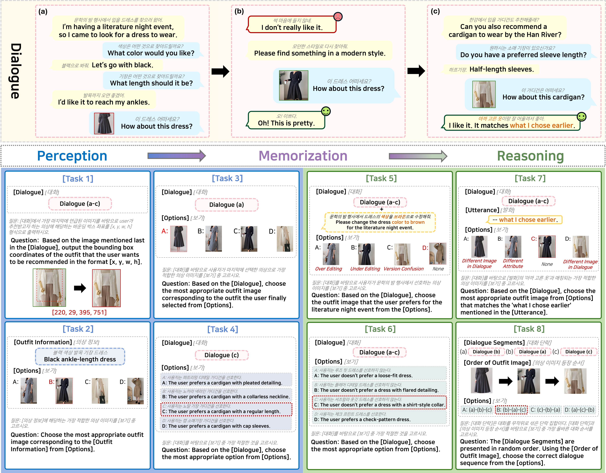

# MMID: Multi-turn Multimodal Interactive Dialogue Benchmark



We introduce the **Multi-turn Multimodal Interactive Dialogue (MMID) Benchmark**, in which user requirements are conveyed incrementally across multiple turns and images are interleaved with text throughout the conversation. This setup supports dynamic multimodal interaction and enables a comprehensive evaluation of MLLMs in terms of **Perception, Memorization, and Reasoning**. With memorization commonly required in multi-turn settings, MMID consists of eight tasks designed to evaluate perception and reasoning in conjunction with memorization.

MMID is derived from [KoMMERCE](https://github.com/MMC-K/multimodal_fashion_dialog_dataset).

At present, the MMID benchmark folder includes only a subset of the data samples. The full dataset will be released after the paper is accepted.

MMID is released under the **Creative Commons Attribution-NonCommercial 4.0 International (CC BY-NC 4.0)** license.

## Evaluating MMID with Qwen3-VL-8B-Instruct

To evaluate MMID using the `Qwen3-VL-8B-Instruct` model, run the following commands:

```bash
python scripts/run_qwen3_vl_instruct.py \
  --model_id Qwen/Qwen3-VL-8B-Instruct \
  --benchmarks all \
  --mode image \
  --template_key Image \
  --save_prompts \
  --count 1 \
  --seed 42

python scripts/run_qwen3_vl_instruct.py \
  --model_id Qwen/Qwen3-VL-8B-Instruct \
  --benchmarks all \
  --mode tags \
  --template_key Tags \
  --save_prompts \
  --count 1 \
  --seed 42
```

## Perception Ability

**Task 1: Context-aware Target Item Grounding** requires the model to take a dialogue containing images as input and, at the final stage of the dialogue, identify the clothing item that corresponds to the user’s requested conditions among the recommended images, and output the spatial location of that item as image coordinates. Specifically, this task evaluates whether the model can accurately recognize the clothing item requested by the user from the dialogue context and correctly map it to its spatial location within the image.

**Task 2: Text-to-Image Attribute Matching** takes textual descriptions of clothing attributes as input and requires the model to select the image that best matches those attributes from a set of candidate images. This task aims to evaluate the model’s ability to judge visual alignment with respect to multiple attributes.

**Task 3: Incremental Requirement-based Image Selection** takes as input a multi-turn, text-only user–assistant dialogue and requires the model to select a clothing image that satisfies the user’s request conditions revealed throughout the dialogue. Unlike Task 2, which directly provides explicit attribute information as input, Task 3 requires the model to progressively recognize and integrate user requirements that are distributed across the entire multi-turn dialogue flow.

**Task 4: Fine-grained Visual Attribute Verification** is based on dialogues that include a single image and requires the model to determine the truthfulness of a sentence describing fine-grained visual attributes of that image. While Tasks 2 and 3 evaluate the process of selecting images based on textually provided attribute information, Task 4 requires the reverse direction of Perception Ability, in which the model must interpret visual information contained in the image and perform attribute-level linguistic judgment. 


## Reasoning Ability

**Task 5: Selective Preference Recall and Editing** takes as input a dialogue that contains two or more distinct scenarios and requires the model to select the most appropriate image when the requirement conditions of a specific scenario are modified based on the user’s final utterance. While Task 2 evaluates the model’s ability to recognize user requirements within a dialogue, Task 5 extends this evaluation by assessing whether the model can identify the scenario indicated by the final user utterance and recall and update the requirement conditions associated with that scenario.

**Task 6: Implicit Preference Reasoning** takes as input a dialogue containing multiple images and requires the model to select the image referred to by deictic expressions appearing in the user’s utterances. The MLLM must identify the referent of the deictic expression based on the dialogue context and recall previously mentioned image information to select the appropriate image.

**Task 7: Visual Reference Recall** takes as input a dialogue containing multiple images and requires the model to judge the truthfulness of a sentence by jointly considering fine-grained visual attributes of each image and the user’s preferences toward those images. While Task 3 evaluates visual attribute perception for a single image, Task 7 extends this setting to assess the model’s ability to distinguish attributes across multiple images and integratively reason about user preferences based on dialogue context.

**Task 8: Vision–Language Temporal Reconstruction** presents shuffled text-based dialogue segments as input and requires the model to reconstruct the correct temporal order of the dialogue based on the accompanying image(s). This task evaluates whether the model can integrate visual information with dialogue context to infer the temporal progression of the conversation.


## Experimental Results

For the overall experimental results on both the English and Korean versions, see [Experimental Results](./Experimental_Results.md).
